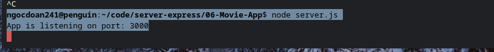
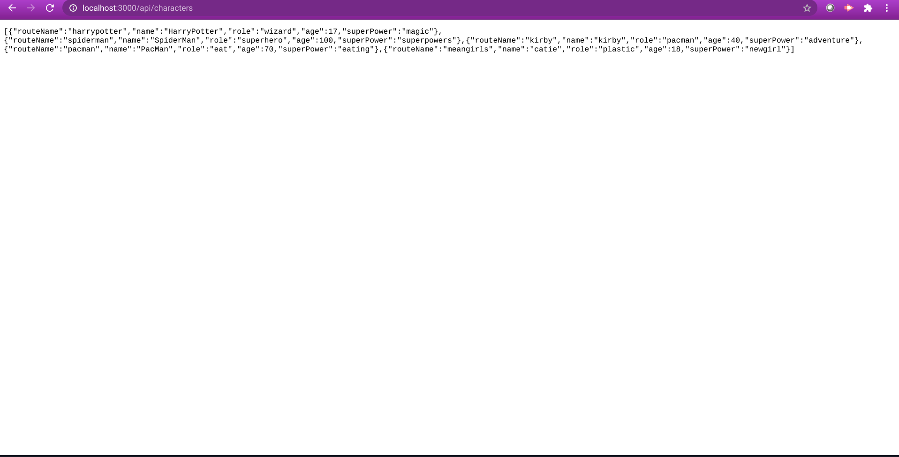
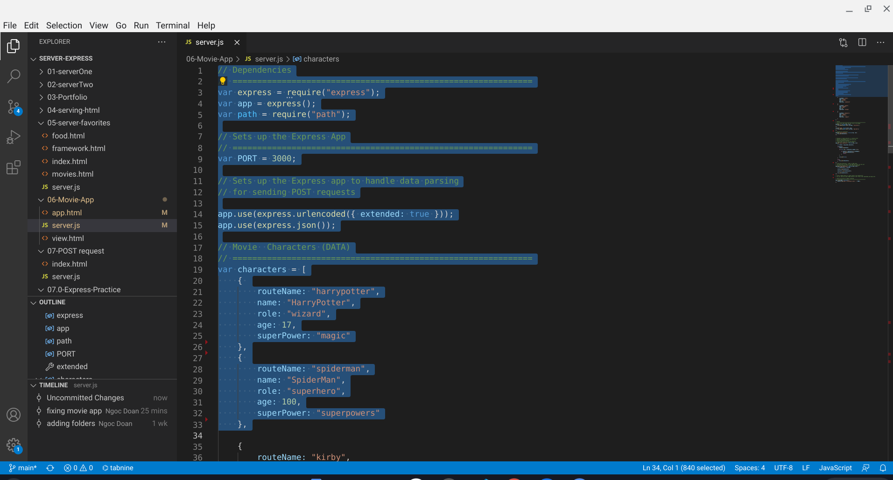
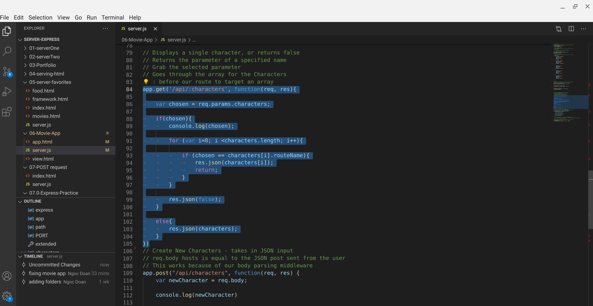
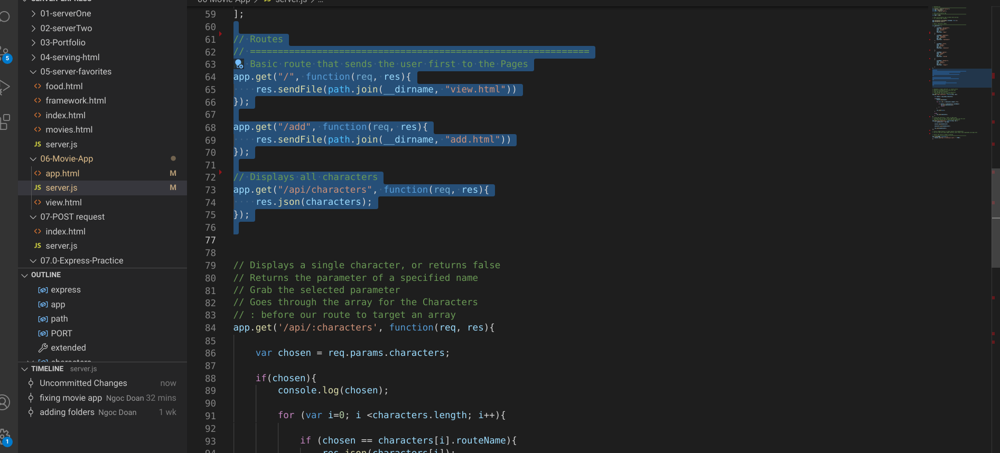
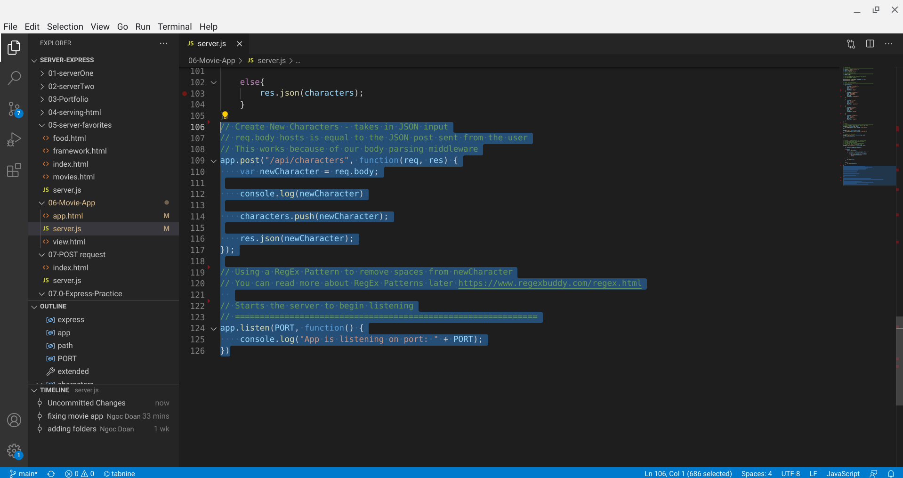

# Movie-App

## **Developer**: Ngoc Doan
## **Place:** *Denver, CO*
## **Institute: Emily Griffith Technical College
## **Title**: Movie-App Assignment  

## **Date: March 05, 2021
## **Goal**:
To show understanding of node

## **Folder 07-Movie App**:

Format: 

